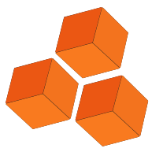
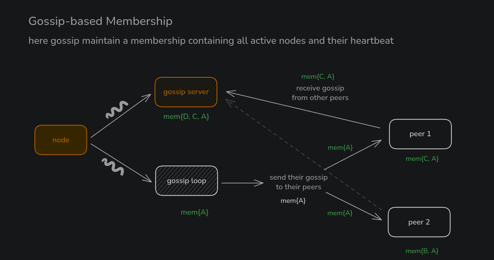
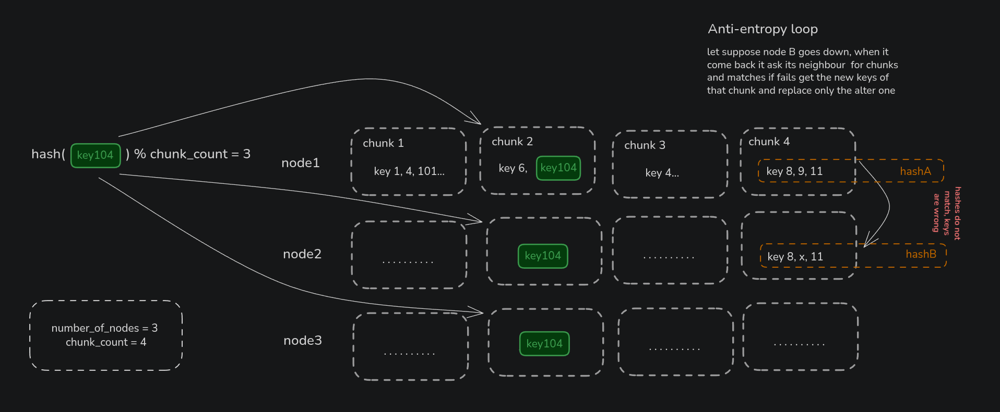

# <div style="{display: 'flex', alignItems: 'center'}"> a3.store - Distributed Key-Value Store</div>

a3.store is a distributed key–value database inspired by DynamoDB and Cassandra, but intentionally minimal in design. By reducing complexity, it’s easy to run locally or deploy with a single command, making it ideal for early-stage project.<br />
[Get started in 3 minutes &rarr;](#quick-start-3-minutes)


## Quick Start (3 minutes)

### Prerquisites
- Python
- docker (optional)
- nodejs (for client testing)

1 - Clone and enter the node folder:

```bash
git clone https://github.com/anasrar/a3.store.git mystore
cd mystore/kv-node
```

2 - Create and activate a Python venv, then install dependencies (recommended to use uv):

```bash
python3 -m venv .venv
source .venv/bin/activate
pip install -r requirements.txt
```

3 - Start a 3-node dev cluster (RF=2):

#### Docker (recommended):

```bash
cd .. && ./scripts/docker.sh # to know more, run: ./scripts/docker.sh help
```

> This will launch 3 nodes in Docker containers and create a virtual network for them to communicate. Each nodes have its own data directory and volume. You can stop the cluster with `./docker.sh stop`. To get all command options, run `./docker.sh help`.

#### Manual (without Docker):


Note: `./kvrun.sh` is the only script you'll find in `./kv-node`.


```bash
# or run interactive nodes:
./kvrun.sh   # answer prompts: node, total nodes (3), replication factor (2)
```

To know configuration variables interactively, run `./kvrun.sh check config`. See the [Configuration (env vars)](#configuration-env-vars) section below for details on each variable.


4 - Test with the provided HTTP client:

```bash
node /node-client/app/test.js
# or use the JS client in your own code (see nodejs-client/grpc_client.js)
node /node-client/app/app.js
```
---

# How it works


Distributed KV Store:
- gRPC for client & inter-node RPCs requests
- Gossip-based membership for peer discovery
- Anti-entropy using keyspace chunk hashing (16 chunks)
- SQLite backend (WAL) per node, configurable replication factor

Deployment options:
1. Docker-based local dev cluster (3 nodes)
2. `minikube` for local k8s testing
3. AWS CloudFormation for managed infra (see `infra/`)

- - Terraform scripts for AWS infra (see `infra/`)
- - Kubernetes manifests for EKS deployment (see `k8s/`)


## Architecture & Design (visual)

High-level diagrams live in `images/`

### Thread model (concise)

- Main thread: process lifecycle
- gRPC thread pool: handles `Put`, `Get`, `Replicate`, `FetchRange`
- Gossip thread: lightweight HTTP endpoint for heartbeat/post
- Background loops: gossip (1s) and anti-entropy (30s)


### Distributed Database Architecture


This diagram shows the cluster topology and request flow: clients send `Put`/`Get` to any node. Writes are synchronously forwarded to the configured number of replicas (replication factor) and wait for Quorum Number(W) this confirms the data consistency across nodes (if during replication some node is down the `PUT` request get pushed to the `HINT` queue - adaopted from Cassandra). Each node runs a local SQLite store (WAL) and exposes gRPC for client and inter-node RPCs. The architecture highlights separation of client-facing traffic, replication paths, and background subsystems (gossip + anti-entropy).

### How Gossip Works



Gossip is the decentralized membership protocol: each node periodically selects peers and sends lightweight heartbeats. Membership updates spread probabilistically (epidemic style); failed nodes are detected via missed heartbeats and membership state converges without a central coordinator.

### Anti-Entropy Chunking



To efficiently repair divergence, the keyspace is split into 16 chunks. Nodes compute a compact hash per chunk and exchange hashes with peers. Only chunks with mismatched hashes are scanned and synchronized by fetching the key ranges, dramatically reducing bandwidth and repair time compared to full key comparisons.

### Deployment Architecture (AWS EKS)


This diagram illustrates a recommended deployment pattern for running `a3.store` on AWS EKS:

### Inbound (User traffic)
1. We have public and private subnets across multiple AZs.
2. Users send requests to the NLB (Network Load Balancer) via Gateway.
3. NLB forwards traffic to a EKS Worker Node on the Traefik NodePort (30080/30443) (cos our cluster is inside privte subnet 10.0.0.0/24).
5. Traefik Controller (Pod) act as a reverse proxy and transfer the request to the correct pods based on ingress rules and request address.
5. Forwarded request reaches api-serive pod defined api endpoints to access the servies of the kv nodes.
9. Backend Pod processes the logic:
  - Reads/Writes to its local EBS Volume (Persistence).
  - Opens a TCP connection to RDS (Metadata) via the RDS-SG.
10. Response travels back: Pod → Traefik → Node → NLB → User.
### Outbound (request to outside services)
This is done via a NAT Gateway in the public subnet, allowing pods in private subnets to access external services securely.

## Implemented 
- Ensure that the security groups (sg) allow necessary traffic (gRPC ports, gossip ports).
- Autoscale the EKS cluster upto 2 worker nodes based on load using Cluster Autoscaler.
- Monitor pods and nodes using Prometheus and Grafana for observability.
- Use NetworkPolicies to limit traffic to gRPC and gossip ports between pods.
- Configure PodDisruptionBudgets and readiness/liveness probes so replicas remain available during rolling updates.


## Want to write your own client request?

```bash
cd node-client/app
```

open `app.js` and modify the `PUT` and `GET` requests as needed. Then run:

```bash
node app.js
```

## API Reference

Core gRPC service (see `proto/kv.proto`):

```protobuf
service KeyValue {
  // client
  rpc Put(PutRequest) returns (PutResponse);
  rpc Get(GetRequest) returns (GetResponse);

  // internal
  rpc Replicate(PutRequest) returns (PutResponse);
  rpc GetChunkHash(ChunkRequest) returns (ChunkHashResponse);
  rpc FetchRange(RangeRequest) returns (stream KeyValuePair);
}
```

Node.js client usage (examples in `node-client/`):

```js
const client = require('./grpc_client.js');
client.put('127.0.0.1:50051', 'user:101', 'Alice', (err,res)=>console.log(res));
client.get('127.0.0.1:50051', 'user:101', (err,res)=>console.log(res));
```

---

## Configuration (env vars)

| Variable             | Default                                              | Purpose                                      |
|----------------------|-----------------------------------------------------|----------------------------------------------|
| NODE_NUM             | `1`                                                 | Node id (unique per process)                 |
| GRPC_PORT            | `50051`                                             | gRPC server port                             |
| GOSSIP_PORT          | `8001`                                              | Gossip HTTP port                             |
| PEERS                | `localhost:50051,localhost:50052,localhost:50053`   | Comma-separated peer gRPC addresses          |
| GOSSIP_PEERS         | `localhost:8001,localhost:8002,localhost:8003`      | Comma-separated peer gossip HTTP addresses   |
| REPLICATION_FACTOR   | `2`                                                 | Number of replicas                           |
| DATA_DIR             | `data/node{N}`                                      | SQLite DB dir                                |
| ANTI_ENTROPY_INTERVAL| `30`                                               | Anti-entropy interval (seconds)              |
| DEBUG_LOG            | `false`                                             | Enable verbose logging                       |


## Debugging & Observability

- Run with verbose logs:

```bash
DEBUG_LOG=true ./kvrun.sh
```

- Key log tags to scan:
  - `[REPLICATE]` — replication attempts/results
  - `[GOSSIP]` — membership events
  - `[ANTI-ENTROPY]` — repair rounds and chunk mismatches


## Project layout (short)

- `kv-node/` — Python node code (server, gossip, anti-entropy, storage)
- `proto/` — `kv.proto` definition
- `nodejs-client/` — JS client + tests
- `scripts/` — helpers (docker.sh, kvrun.sh)
- `infra/`, `k8s/`, `terraform/` — deployment manifests
