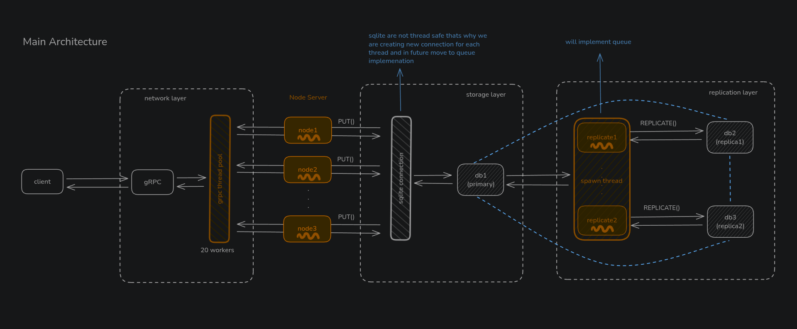
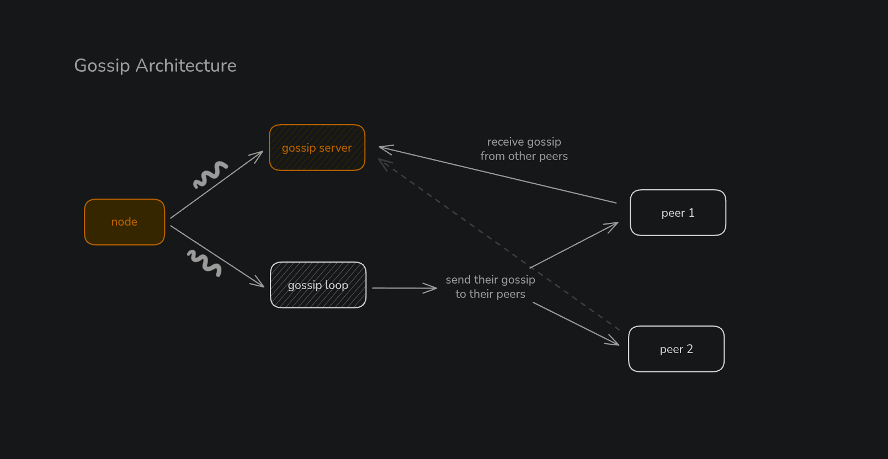
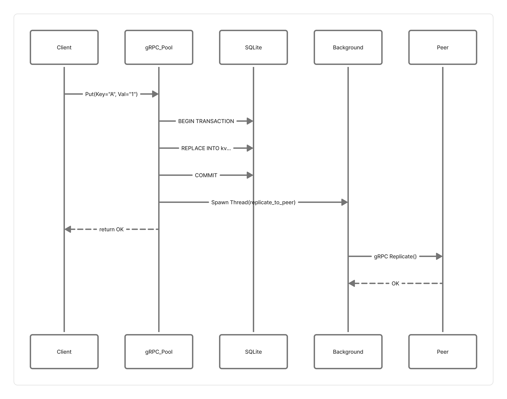

# a3.redis — Distributed Key-Value Store

<div align="center">

**A Dynamo-style distributed key-value database with no central coordinator**

[](https://python.org)
[](https://grpc.io)
[](https://nodejs.org)
[](https://sqlite.org)

</div>

---

## 🎯 Overview

**a3.redis** is a fully decentralized, peer-to-peer distributed key-value store implementing real distributed systems concepts used in production databases like **Amazon DynamoDB**, **Apache Cassandra**, and **Riak**.

### Key Design Principles

- **No Single Point of Failure** — Every node is equal; no master/slave hierarchy
- **Eventual Consistency** — Writes are fast; replicas converge over time
- **Partition Tolerant** — System remains available even when nodes fail
- **Self-Healing** — Anti-entropy automatically repairs data inconsistencies

---

## 🏗️ Architecture

<div align="center">

</div>

---

## 🔧 Technology Stack

| Component | Technology | Purpose |
|-----------|------------|---------|
| **Server Runtime** | Python 3.10+ | Node engine & business logic |
| **RPC Framework** | gRPC + Protobuf | Client API & inter-node replication |
| **HTTP Server** | FastAPI + Uvicorn | Gossip protocol endpoints |
| **Storage Engine** | SQLite (WAL mode) | Durable local persistence |
| **Client** | Node.js | gRPC client for testing |

---

## 📦 Core Distributed Systems Features

### 1️⃣ Consistent Hashing Ring

Keys are distributed across nodes using consistent hashing:

```
                    Hash Ring (0 to 2^32)
                         ┌──────┐
                      ╱──│Node 1│──╲
                    ╱    └──────┘    ╲
               ┌──────┐            ┌──────┐
               │Node 3│            │Node 2│
               └──────┘            └──────┘
                    ╲              ╱
                      ╲──────────╱

    hash("user:123") = 0x4A2B... → Routes to Node 2
    hash("order:456") = 0xE1F3... → Routes to Node 1
```

**Benefits:**
- Adding/removing nodes only redistributes ~1/N keys
- Load is balanced across all nodes
- Replication factor determines data redundancy

---

### 2️⃣ Gossip-Based Membership Protocol

Fully decentralized peer discovery — no central registry needed.

<div align="center">

</div>

**How it works:**
- Each node sends heartbeats to known peers every 1 second
- Heartbeat contains: `node_id`, `address`, `heartbeat_counter`
- Nodes merge received heartbeats (higher counter wins)
- Result: Eventually consistent cluster membership

---

### 3️⃣ Asynchronous Replication

When a client writes data:

<div align="center">

</div>

**Characteristics:**
- Client gets fast response (single node write)
- Replication happens in background threads
- System remains available if replicas are temporarily down
- Failed replications are recovered via anti-entropy

---

### 4️⃣ Anti-Entropy Repair (Self-Healing)

Background process that synchronizes data between nodes:

<div align="center">

</div>

**This repairs:**
- Missed replications (network partitions)
- Data from nodes that were temporarily down
- Divergent data using Last-Write-Wins (LWW)

---

### 5️⃣ Thread Architecture & Queue-Based Coordination

Each node runs multiple concurrent subsystems:

```
┌─────────────────────────────────────────────────────────────────────┐
│                         Node Process                                │
│                                                                     │
│  ┌─────────────────┐  ┌─────────────────┐  ┌─────────────────────┐  │
│  │   Main Thread   │  │  gRPC Thread    │  │  Gossip HTTP Thread │  │
│  │                 │  │     Pool        │  │    (Uvicorn)        │  │
│  │  Orchestrates   │  │                 │  │                     │  │
│  │  startup &      │  │  Handles:       │  │  Handles:           │  │
│  │  shutdown       │  │  - Put/Get      │  │  - POST /gossip     │  │
│  │                 │  │  - Replicate    │  │                     │  │
│  └─────────────────┘  │  - GetChunkHash │  └─────────────────────┘  │
│                       │  - FetchRange   │                           │
│  ┌─────────────────┐  └─────────────────┘  ┌─────────────────────┐  │
│  │  Gossip Loop    │                       │  Anti-Entropy Loop  │  │
│  │    Thread       │                       │      Thread         │  │
│  │                 │                       │                     │  │
│  │  Every 1s:      │                       │  Every 30s:         │  │
│  │  Send heartbeat │                       │  Compare & repair   │  │
│  │  to all peers   │                       │  data with peers    │  │
│  └─────────────────┘                       └─────────────────────┘  │
│                                                                     │
│  ┌─────────────────────────────────────────────────────────────┐    │
│  │                  SQLite Storage (Thread-Local Connections)  │    │
│  │                       WAL Mode for Concurrent Access        │    │
│  └─────────────────────────────────────────────────────────────┘    │
└─────────────────────────────────────────────────────────────────────┘
```

**⚠️ Critical Sections & Future Queue Integration:**

For high-throughput production use, the following areas would benefit from task queues:

| Area | Current | Future Enhancement |
|------|---------|-------------------|
| Replication | Fire-and-forget threads | Redis/RabbitMQ queue with retry |
| Anti-entropy repairs | Direct writes | Batched write queue |
| Failed replications | Logged & dropped | Hinted handoff queue |

---

## 🚀 Getting Started

### Prerequisites

- Python 3.10+
- Node.js 18+ (for client)
- [uv](https://github.com/astral-sh/uv) (recommended) or pip

### 1. Clone the Repository

```bash
git clone https://github.com/yourusername/dist-redis.git
cd dist-redis
```

### 2. Setup Python Server

```bash
cd dist-server

# Using uv (recommended)
uv venv .venv
source .venv/bin/activate
uv sync

# Or using pip
python3 -m venv .venv
source .venv/bin/activate
pip install -r requirements.txt
```

### 3. Start a 3-Node Cluster

Open **3 separate terminals**:

**Terminal 1:**
```bash
cd dist-server
source .venv/bin/activate
./run-server.sh
# Enter: Node number: 1, Total nodes: 3, Replication factor: 2
```

**Terminal 2:**
```bash
cd dist-server
source .venv/bin/activate
./run-server.sh
# Enter: Node number: 2, Total nodes: 3, Replication factor: 2
```

**Terminal 3:**
```bash
cd dist-server
source .venv/bin/activate
./run-server.sh
# Enter: Node number: 3, Total nodes: 3, Replication factor: 2
```

### 4. Setup Node.js Client

```bash
cd nodejs-client
npm install
```

### 5. Test the Cluster

```bash
# Run the distributed test
node app/test-distributed.js
```

**Expected Output:**
```
========================================
   Distributed Database Test Suite
========================================

TEST 1: Write to Node 1
  ✅ PUT response: {"ok":true,"message":"stored"}

TEST 2: Read from ALL nodes (verify replication)
  ✅ Node 1: Found correct value
  ✅ Node 2: Found correct value
  ✅ Node 3: Found correct value

========================================
✅ Distributed database is working correctly!
```

---

## 🔌 API Reference

### gRPC Service Definition

```protobuf
service KeyValue {
  // Client-facing RPCs
  rpc Put(PutRequest) returns (PutResponse);
  rpc Get(GetRequest) returns (GetResponse);
  
  // Internal node-to-node RPCs
  rpc Replicate(PutRequest) returns (PutResponse);
  rpc GetChunkHash(ChunkRequest) returns (ChunkHashResponse);
  rpc FetchRange(RangeRequest) returns (stream KeyValuePair);
}
```

### Node.js Client Usage

```javascript
const client = require('./grpc_client.js');

// Write a key
client.put('127.0.0.1:50051', 'user:123', 'John Doe', (err, res) => {
  console.log('PUT:', res);  // { ok: true, message: 'stored' }
});

// Read a key
client.get('127.0.0.1:50051', 'user:123', (err, res) => {
  console.log('GET:', res);  // { value: 'John Doe', found: true }
});
```

---

## 🐛 Debug Logging

Enable detailed logging to see replication, gossip, and anti-entropy in action:

```bash
DEBUG_LOG=true ./run-server.sh
```

**Log Output Example:**
```
[WRITE] Node=127.0.0.1:50051 | Key=name | Value=anas | Timestamp=1733356800
[REPLICAS] Key=name will replicate to: ['127.0.0.1:50052', '127.0.0.1:50053']
[REPLICATE→] 127.0.0.1:50051 → 127.0.0.1:50052 | Key=name
[REPLICATE✓] Successfully replicated key=name to 127.0.0.1:50052
[GOSSIP] New node discovered: node-2 @ 127.0.0.1:50052
[ANTI-ENTROPY] Starting sync round with peers: ['127.0.0.1:50052']
```

---

## 📁 Project Structure

```
dist-redis/
├── README.md                 # This file
├── image.png                 # Architecture diagram
├── proto/
│   └── kv.proto              # gRPC service definition
├── scripts/
│   └── generate-stubs.sh     # Regenerate gRPC stubs
├── dist-server/              # Python server
│   ├── app/
│   │   ├── node.py           # Main entry point
│   │   ├── grpc_server.py    # gRPC service implementation
│   │   ├── grpc_client.py    # Internal gRPC client
│   │   ├── gossip.py         # Gossip membership protocol
│   │   ├── anti_entropy.py   # Background repair loop
│   │   ├── storage.py        # SQLite storage engine
│   │   ├── kv_pb2.py         # Generated protobuf
│   │   └── kv_pb2_grpc.py    # Generated gRPC stubs
│   ├── run-server.sh         # Node launcher script
│   ├── pyproject.toml        # Python dependencies
│   └── data/                 # SQLite databases per node
└── nodejs-client/            # Node.js client
    ├── grpc_client.js        # gRPC client library
    ├── app/
    │   ├── app.js            # Simple test
    │   └── test-distributed.js # Full cluster test
    └── package.json
```

---

## ⚙️ Configuration

### Environment Variables

| Variable | Default | Description |
|----------|---------|-------------|
| `NODE_NUM` | `1` | Node identifier (1, 2, 3, ...) |
| `GRPC_PORT` | `50051` | gRPC server port |
| `GOSSIP_PORT` | `8001` | Gossip HTTP port |
| `REPLICATION_FACTOR` | `2` | Number of replicas per key |
| `DEBUG_LOG` | `false` | Enable verbose logging |
| `DATA_DIR` | `data/node{N}` | SQLite database directory |

### Cluster Sizing Guide

| Nodes | Replication Factor | Fault Tolerance | Use Case |
|-------|-------------------|-----------------|----------|
| 1 | 1 | 0 failures | Development |
| 3 | 2 | 1 failure | Testing |
| 3 | 3 | 2 failures | Production (minimal) |
| 5 | 3 | 2 failures | Production (recommended) |

---

## 🎓 Distributed Systems Concepts Implemented

| Concept | Implementation |
|---------|----------------|
| **Consistent Hashing** | Hash-based key distribution across ring |
| **Gossip Protocol** | Decentralized membership via heartbeats |
| **Eventual Consistency** | Async replication with LWW conflict resolution |
| **Anti-Entropy** | Merkle-tree-style chunk hash comparison |
| **Replication** | Configurable N-way replication |
| **Partition Tolerance** | System operates during network splits |
| **Self-Healing** | Automatic data repair after failures |

---

## 📚 References & Inspiration

- [Amazon Dynamo Paper](https://www.allthingsdistributed.com/files/amazon-dynamo-sosp2007.pdf)
- [Apache Cassandra Architecture](https://cassandra.apache.org/doc/latest/architecture/)
- [Riak KV](https://riak.com/products/riak-kv/)
- [HashiCorp Serf (Gossip)](https://www.serf.io/)

---

## 📄 License

MIT License - feel free to use this for learning and building!

---

<div align="center">

**Built with ❤️ to learn distributed systems**

</div>
